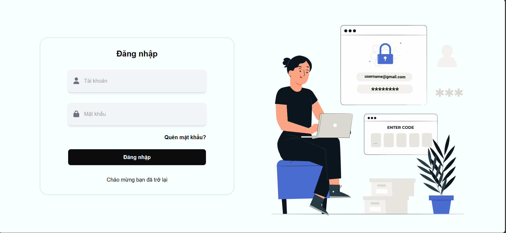

📦 Quản lý nhân sự
Ứng dụng dùng để quản lý nhân sự trong việc check in, out bằng mã QR code trong thẻ CCCD.

🛠️ Các chức năng chính
✅ Check In, Out bằng thẻ CCCD thông qua Webcam

✅ Quản lý tài khoản truy cập

✅ Quản lý nhân viên

📸 Ảnh minh họa

🏗️ Công nghệ sử dụng
⚡ Ngôn ngữ: (Typscript / C#)

⚡ Framework: (Nextjs / ASP.NET Core)

⚡ Database: (SQL SERVER)

⚡ Công cụ khác: (Docker...)

🛠️ Cài đặt
Clone project:

bash
git clone https://github.com/PhucHau0310/Personnel-Management.git
