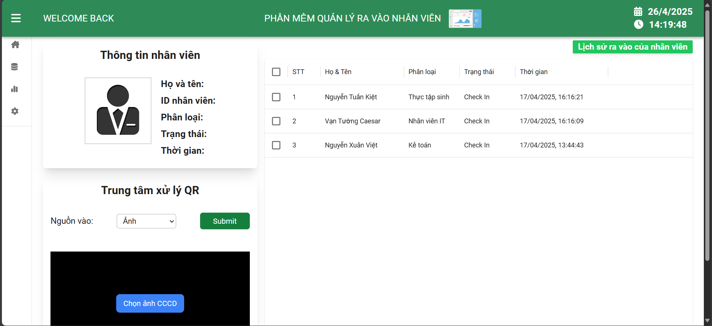

# 🚀 Personnel Management

Application used to manage personnel in checking in and out using QR code in CCCD card.

## 🛠️ Features

✅ Check In, Out with CCCD card via Webcam

✅ Manage access accounts

✅ Manage employee

## 📸 Screenshots

### Home Page


### Login Page


## 🏗️ Technologies

⚡ Programming Languages: (Typscript / C#)

⚡ Framework: (Nextjs / ASP.NET Core)

⚡ Database: (SQL SERVER)

⚡ Others: (Docker...)

## 📦 Installation & Setup

``` bash
git clone https://github.com/PhucHau0310/Personnel-Management.git
cd root project
run docker-compose up -d --build
```

## 📜 License

This project is licensed under the MIT License.

## 👤 Author
- GitHub: [PhucHau0310](https://github.com/PhucHau0310)
- Email: haunhpr024@gmail.com
